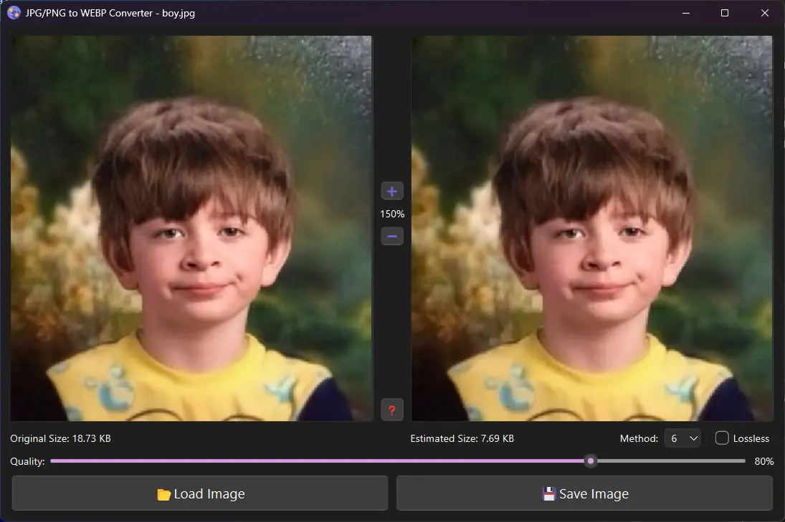

# Image Converter to WEBP

This application converts JPG, JPEG, and PNG images to WEBP format with the ability to choose compression quality.



## Features

- Load JPG, JPEG, or PNG images
- Convert images to WEBP format
- Adjust compression quality using a slider
- Zoom in and out on the original and converted images
- View the original and estimated converted image sizes

## Requirements

- Python 3.x (tested with 3.13 windows x64)
- PyQt5
- Pillow

## Installation

1. Clone the repository:
    ```sh
    git clone https://github.com/yourusername/image_converter2webp.git
    cd image_converter2webp
    ```

2. Install the required packages:
    ```sh
    pip install -r requirements.txt
    ```

## Usage

1. Run the application:
    ```sh
    python image_converter2webp.py
    ```

2. Use the "Load Image" button to select an image file.
3. Adjust the compression quality using the slider.
4. Use the "Save Image" button to save the converted image in WEBP format.

## Usage 2
Download last release, unzip and run `Image Converter 2 WEBP.exe` file.

## License

This project is licensed under the MIT License.